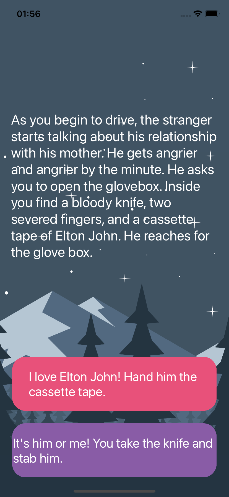

# Destini

## Descrição do projeto

Projeto de desafio do curso _iOS & Swift - The Complete iOS App Development Bootcamp_ com a finalidade de criar um aplicativo nativo iOS de histórias com opções.

## Conhecimentos reforçados

- struct em Swift
- Arquitetura de projeto MVC
- Conceito de imutabilidade

## Aplicação

